django-ajax-datatable
=====================

django-ajax-datatable is a Django app which provides the integration of a Django
project with the jQuery Javascript library DataTables.net,
when used with server-side processing mode.

In this context, the rendering of the table is the result of a serie of Ajax
requests to the server following user interactions (i.e. when paging, ordering, searching, etc.).

With django-ajax-datatable, basically you have to provide a AjaxDatatableView-derived view
to describe the desired table content and behaviour, and the app manages the interaction
with DataTables.net by reacting to the ajax requests with suitable responses.

Notes:

   Since someone asked ...

   - I use this app for my own projects, and improve it from time to time as new needs arises.

   - I received so much from the Django community, so I'm more than happy to share something hopefully useful for others.
     The app is intended to be opensource; feel free to use it we no restrictions at all.
     I added a MIT Licence file to the github repo, to make this more explicit.

   - Since v4.0.0, the package has been renamed from `django-datatables-view` to `django-ajax-datatable`
     to avoid a conflict on PyPI

   - Unfortunately I only have a few unit tests, and didn't bother (yet) to add a TOX procedure to run then with
     different Python/Django versions.
     Having said this, I can confirm that I do happen to use it with no problems in projects based on Django 2.x.
     However, most recent improvements have been tested mainly with Django 3.
     As far as I know, no Django3-specific features have been applied.
     In case, please open an issue, and I will fix it.

   - I'm not willing to support Python 2.x and Django 1.x any more; in case, use a previous release (tagged as v2.x.x);
     old releases will be in place in the repo forever

Features:

- Pagination
- Column ordering
- Global generic search
- Global date-range search over "get_latest_by" column
- Column specific filtering
- Foreign key fields can be used, using the "model1__model2__field" notation
- Customizable rendering of table rows
- and more ...

Inspired from:

https://github.com/monnierj/django-datatables-server-side

.. contents::

.. sectnum::

Demo site and examples
----------------------

A very minimal working Django project which uses `django-ajax-datatable` can be found in the folder `example_minimal`.

A more realistic solution, with a frontend based on Bootstrap4, can be found in `example`,
and is published as a demo site at the address: http://django-ajax-datatable-demo.brainstorm.it/.

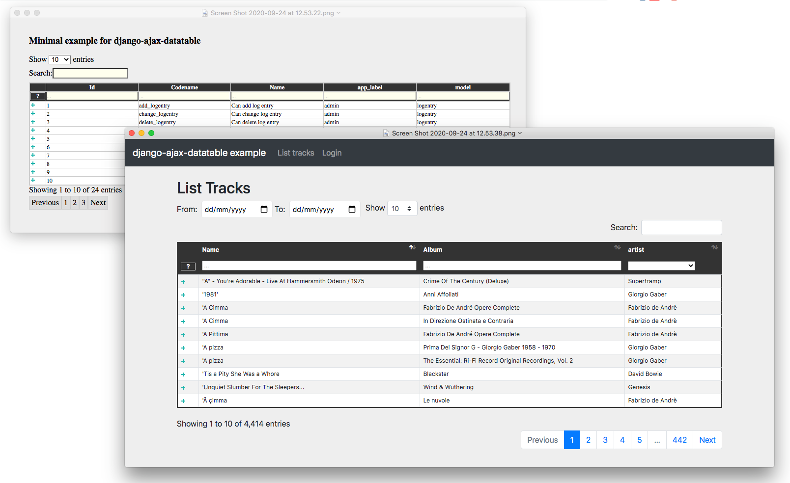

Installation
------------

Install the package by running:

.. code:: bash

    pip install django-ajax-datatable

or:

.. code:: bash

    pip install git+https://github.com/morlandi/django-ajax-datatable@v4.0.0

then add 'ajax_datatable' to your INSTALLED_APPS:

.. code:: bash

    INSTALLED_APPS = [
        ...
        'ajax_datatable',
    ]

Pre-requisites
--------------

Your base template should include what required by `datatables.net`, plus:

- /static/ajax_datatable/css/style.css
- /static/ajax_datatable/js/utils.js

Example (plain jQuery from CDN):

.. code:: html

    

        <link href="" rel="stylesheet" />
        <link href="//cdn.datatables.net/1.10.22/css/jquery.dataTables.min.css" />

    

    

        
        
        

    

Example (with Bootstrap4 support):

.. code:: html

    

        <link href="" rel="stylesheet" />
        <!-- link rel='stylesheet' href="" -->
        <link rel='stylesheet' href="">
        <link rel='stylesheet' href="">

    

    

        

        
        <!-- script src=""></script -->
        
        
        
        
        
        
        
        

    

Basic AjaxDatatableView
-----------------------

To provide server-side rendering of a Django Model, you need a specific
view derived from AjaxDatatableView() which will be called multiple times via Ajax during data navigation.

At the very minimum, you shoud specify a suitable `column_defs` list.

Example:

`urls.py`

.. code:: python

    from django.urls import path
    from . import ajax_datatable_views

    app_name = 'frontend'

    urlpatterns = [
        ...
        path('ajax_datatable/permissions/', ajax_datatable_views.PermissionAjaxDatatableView.as_view(), name="ajax_datatable_permissions"),
    ]

`ajax_datatable_views.py`

.. code:: python

    from ajax_datatable.views import AjaxDatatableView
    from django.contrib.auth.models import Permission

    class PermissionAjaxDatatableView(AjaxDatatableView):

        model = Permission
        title = 'Permissions'
        initial_order = [["app_label", "asc"], ]
        length_menu = [[10, 20, 50, 100, -1], [10, 20, 50, 100, 'all']]
        search_values_separator = '+'

        column_defs = [
             AjaxDatatableView.render_row_tools_column_def(),
            {'name': 'id', 'visible': False, },
            {'name': 'codename', 'visible': True, },
            {'name': 'name', 'visible': True, },
            {'name': 'app_label', 'foreign_field': 'content_type__app_label', 'visible': True, },
            {'name': 'model', 'foreign_field': 'content_type__model', 'visible': True, },
        ]

In the previous example, row id is included in the first column of the table,
but hidden to the user.

AjaxDatatableView will serialize the required data during table navigation;
in order to render the initial web page which should contain the table,
you need another "application" view, normally based on a template.

`Usage: (file permissions_list.html)`

.. code:: python

    <table id="datatable_permissions">
    </table>

    ...

    

In the template, insert a <table> element and connect it to the DataTable machinery,
calling **AjaxDatatableViewUtils.initialize_table(element, url, extra_options={}, extra_data={})**, which will in turn
perform a first call (identified by the `action=initialize` parameter)
to render the initial table layout.

In this initial phase, the (base) view's responsibility is that of providing to DataTables
the suitable columns specifications (and other details), based on the `column_defs`
attribute specified in the (derived) view class.

Then, subsequent calls to the view will be performed to populate the table with real data.

This strategy allows the placement of one or more dynamic tables in the same page.

In simpler situations, where only one table is needed, you can use a single view
(the one derived from AjaxDatatableView); the rendered page is based on the default
template `ajax_datatable/database.html`, unless overridden.

This is the resulting table:

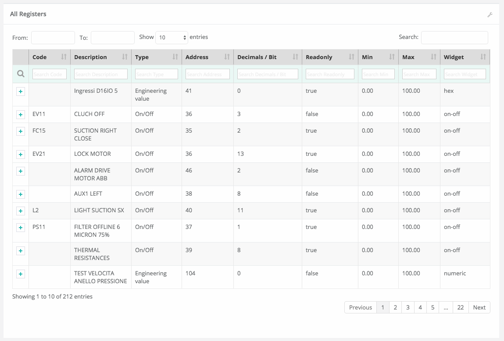

AjaxDatatableViewUtils.initialize_table() parameters are:

    element
        table element

    url
        action (remote url to be called via Ajax)

    extra_options={}
        custom options for dataTable()

    extra_data={}
        extra parameters to be sent via ajax for custom filtering

AjaxDatatableView Class attributes
----------------------------------

Required:

- model
- column_defs

Optional:

- template_name = 'ajax_datatable/datatable.html'
- initial_order = [[1, "asc"], [5, "desc"]]   # positions can also be expressed as column names: [['surname', 'asc'], ]
- length_menu = [[10, 20, 50, 100], [10, 20, 50, 100]]
- latest_by = None
- show_date_filters = None
- show_column_filters = None
- disable_queryset_optimization = False
- table_row_id_prefix = 'row-'
- table_row_id_fieldname = 'id'
- render_row_details_template_name = "render_row_details.html"
- search_values_separator = ''

or override the following methods to provide attribute values at run-time,
based on request:

.. code:: python

    def get_column_defs(self):
        return self.column_defs

    def get_initial_order(self):
        return self.initial_order

    def get_length_menu(self):
        return self.length_menu

    def get_template_name(self):
        return self.template_name

    def get_latest_by(self, request):
        """
        Override to customize based on request.

        Provides the name of the column to be used for global date range filtering.
        Return either '', a fieldname or None.

        When None is returned, in model's Meta 'get_latest_by' attributed will be used.
        """
        return self.latest_by

    def get_show_date_filters(self, request):
        """
        Override to customize based on request.

        Defines whether to use the global date range filter.
        Return either True, False or None.

        When None is returned, will'll check whether 'latest_by' is defined
        """
        return self.show_date_filters

    def get_show_column_filters(self, request):
        """
        Override to customize based on request.

        Defines whether to use the column filters.
        Return either True, False or None.

        When None is returned, check if at least one visible column in searchable.
        """
        return self.show_column_filters

    def get_table_row_id(self, request, obj):
        """
        Provides a specific ID for the table row; default: "row-ID"
        Override to customize as required.
        """
        result = ''
        if self.table_row_id_fieldname:
            try:
                result = self.table_row_id_prefix + str(getattr(obj, self.table_row_id_fieldname))
            except:
                result = ''
        return result

column_defs customizations
--------------------------

Example::

    column_defs = [{
        'name': 'currency',                 # required
        'data': None,
        'title': 'Currency',                # optional: default = field verbose_name or column name
        'visible': True,                    # optional: default = True
        'searchable': True,                 # optional: default = True if visible, False otherwise
        'orderable': True,                  # optional: default = True if visible, False otherwise
        'foreign_field': 'manager__name',   # optional: follow relation
        'placeholder': False,               # ???
        'className': 'css-class-currency',  # optional class name for cell
        'defaultContent': '<h1>test</h1>',  # ???
        'width': 300,                       # optional: controls the minimum with of each single column
        'choices': None,                    # see `Filtering single columns` below
        'initialSearchValue': None,         # see `Filtering single columns` below
        'autofilter': False,                # see `Filtering single columns` below
        'boolean': False,                   # treat calculated column as BooleanField
        'max_length': 0,                    # if > 0, clip result longer then max_length
    }, {
        ...

Notes:

    - **title**: if not supplied, the verbose name of the model column (when available)
      or **name** will be used
    - **width**: for this to be effective, you need to add **table-layout: fixed;** style
      to the HTML table, but in some situations this causes problems in the computation
      of the table columns' widths (at least in the current version 1.10.19 of Datatables.net)

Automatic addition of table row ID
----------------------------------

Starting from v3.2.0, each table row is characterized with a specific ID on each row
(tipically, the primary key value from the queryset)

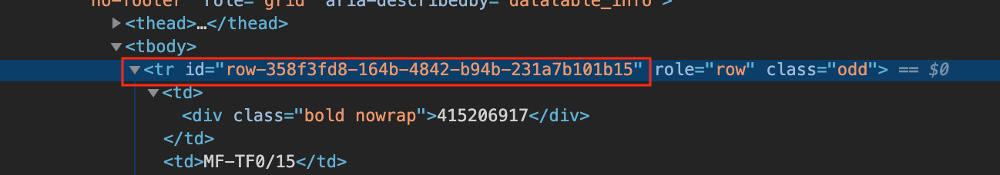

The default behaviour is to provide the string "row-ID", where:

- "row-" is retrieved from self.table_row_id_prefix
- "ID" is retrieved from the row object, using the field with name self.table_row_id_fieldname (default: "id")

Note that, for this to work, you are required to list the field "id" in the column list (maybe hidden).

This default behaviour can be customized by either:

- replacing the values for `table_row_id_fieldname` and/or `table_row_id_prefix`, or
- overriding `def get_table_row_id(self, request, obj)`

Filtering single columns
------------------------

**DatatableView.show_column_filters** (or **DatatableView.get_show_column_filters(request)**)
defines whether to show specific filters for searchable columns as follows:

    - None (default): show if at least one visible column in searchable
    - True: always show
    - False: always hide

By default, a column filter for a searchable column is rendered as a **text input** box;
you can instead provide a **select** box using the following attributes:

choices
    - None (default) or False: no choices (use text input box)
    - True: use Model's field choices;
        + failing that, we might use "autofilter"; that is: collect the list of distinct values from db table
        + or, for **BooleanField** columns, provide (None)/Yes/No choice sequence
        + calculated columns with attribute 'boolean'=True are treated as BooleanFields
    - ((key1, value1), (key2, values), ...) : use supplied sequence of choices

autofilter
    - default = False
    - when set: if choices == True and no Model's field choices are available,
      collects distinct values from db table (much like Excel "autofilter" feature)

For the first rendering of the table:

initialSearchValue
    - optional initial value for column filter

Note that `initialSearchValue` can be a value or a callable object.
If callable it will be called every time a new object is created.

For example:

.. code:: python

    class MyAjaxDatatableView(AjaxDatatableView):

        def today():
            return datetime.datetime.now().date()

        ...

        column_defs = [
            ...
            {
                'name': 'created',
                'choices': True,
                'autofilter': True,
                'initialSearchValue': today
            },
            ...
        ]

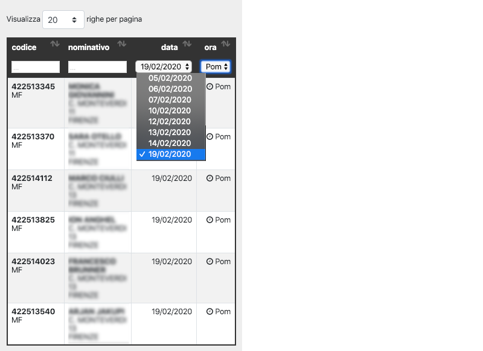

Filtering multiple values
-------------------------

Searching on multiple values can be obtained by assigning a "search value separator"
as in the following example::

    search_values_separator = '+'

In this case, if the user inputs "aaa + bbb", the following search will be issued::

    Q("aaa") | Q("bbb")

This works for text search on both global and columns filters.

TODO: test with dates, choices and autofilter.

Computed (placeholder) columns
------------------------------

You can insert placeholder columns in the table, and feed their content with
arbitrary HTML.

Example:

.. code:: python

    @method_decorator(login_required, name='dispatch')
    class RegisterAjaxDatatableView(AjaxDatatableView):

        model = Register
        title = _('Registers')

        column_defs = [
            {
                'name': 'id',
                'visible': False,
            }, {
                'name': 'created',
            }, {
                'name': 'dow',
                'title': 'Day of week',
                'placeholder': True,
                'searchable': False,
                'orderable': False,
                'className': 'highlighted',
            }, {
                ...
            }
        ]

        def customize_row(self, row, obj):
            days = ['monday', 'tuesday', 'wednesday', 'thyrsday', 'friday', 'saturday', 'sunday']
            if obj.created is not None:
                row['dow'] = '<b>%s</b>' % days[obj.created.weekday()]
            else:
                row['dow'] = ''
            return

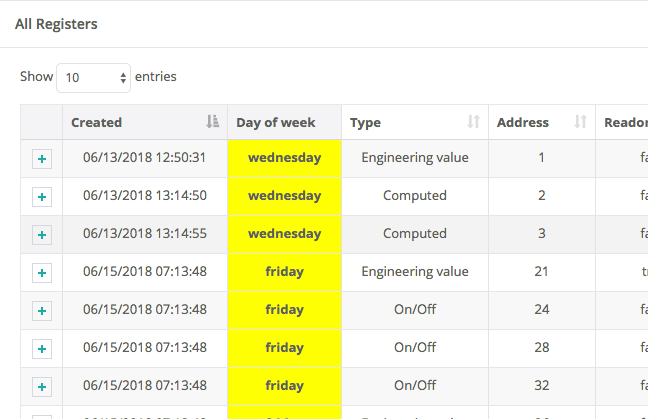

Clipping results
----------------

Sometimes you might want to clip results up to a given maximum length, to control the column width.

This can be obtained by specifying a positive value for the `max_length` column_spec attribute.

Results will be clipped in both the column cells and in the column filter.

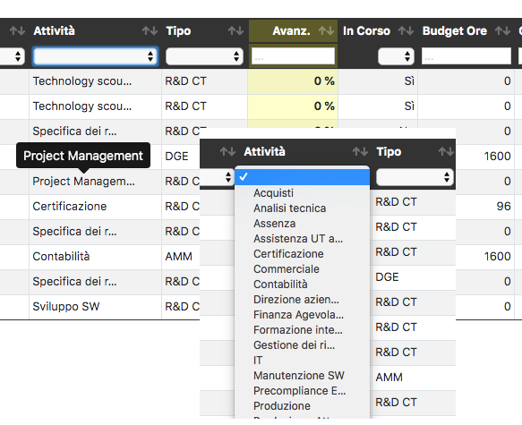

Clipped results are rendered as html text as follows:

.. code:: python

    def render_clip_value_as_html(self, long_text, short_text, is_clipped):
        """
        Given long and shor version of text, the following html representation:
            short_text[ellipsis]

        To be overridden for further customisations.
        """
        return '{short_text}{ellipsis}'.format(
            long_text=long_text,
            short_text=short_text,
            ellipsis='&hellip;' if is_clipped else ''
        )

You can customise the rendering by overriding `render_clip_value_as_html()`

Receiving table events
----------------------

The following table events are broadcasted to your custom handlers, provided
you subscribe them:

- initComplete(table)
- drawCallback(table, settings)
- rowCallback(table, row, data)
- footerCallback(table, row, data, start, end, display)

Please note the the first parameter of the callback is always the event,
and next parameters are additional data::

    .trigger('foo', [1, 2]);

    .on('foo', function(event, one, two) { ... });

More events triggers sent directly by DataTables.net are listed here:

    https://datatables.net/reference/event/

Example:

.. code :: html

    

        <table id="datatable" width="100%" class="table table-striped table-bordered dataTables-log">
        </table>
    

    

Overridable AjaxDatatableView methods
-------------------------------------

get_initial_queryset()
......................

Provides the queryset to work with; defaults to **self.model.objects.all()**

Example:

.. code:: python

    def get_initial_queryset(self, request=None):
        if not request.user.view_all_clients:
            queryset = request.user.related_clients.all()
        else:
            queryset = super().get_initial_queryset(request)
        return queryset

get_foreign_queryset()
......................

When collecting data for autofiltering in a "foreign_field" column, we need some data
source for doing the lookup.

The default implementation is as follows:

.. code:: python

    def get_foreign_queryset(self, request, field):
        queryset = field.model.objects.all()
        return queryset

You can override it for further reducing the resulting list.

customize_row()
...............

Called every time a new data row is required by the client, to let you further
customize cell content

Example:

.. code:: python

    def customize_row(self, row, obj):
        # 'row' is a dictionary representing the current row, and 'obj' is the current object.
        row['code'] = '<a class="client-status client-status-%s" href="%s">%s</a>' % (
            obj.status,
            reverse('frontend:client-detail', args=(obj.id,)),
            obj.code
        )
        if obj.recipe is not None:
            row['recipe'] = obj.recipe.display_as_tile() + ' ' + str(obj.recipe)
        return

render_row_details()
....................

Renders an HTML fragment to show table row content in "detailed view" fashion,
as previously explained later in the **Add row tools as first column** section.

See also: `row details customization`_

Example:

.. code:: python

    def render_row_details(self, id, request=None):
        client = self.model.objects.get(id=id)
        ...
        return render_to_string('frontend/pages/includes/client_row_details.html', {
            'client': client,
            ...
        })

footer_message()
................

You can annotate the table footer with a custom message by overridding the
following View method.

.. code:: python

    def footer_message(self, qs, params):
        """
        Overriden to append a message to the bottom of the table
        """
        return None

Example:

.. code:: python

    def footer_message(self, qs, params):
        return 'Selected rows: %d' % qs.count()

.. code:: html

    

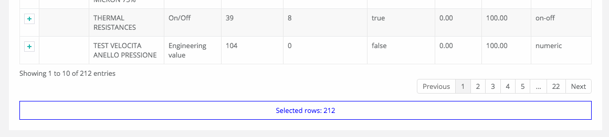

render_clip_value_as_html()
...........................

Renders clipped results as html span tag, providing the non-clipped value as title:

.. code:: python

    def render_clip_value_as_html(self, long_text, short_text, is_clipped):
        """
        Given long and shor version of text, the following html representation:
            short_text[ellipsis]

        To be overridden for further customisations.
        """
        return '{short_text}{ellipsis}'.format(
            long_text=long_text,
            short_text=short_text,
            ellipsis='&hellip;' if is_clipped else ''
        )

Override to customise the rendering of clipped cells.

Queryset optimization
=====================

As the purpose of this module is all about querysets rendering, any chance to optimize
data extractions from the database is more then appropriate.

Starting with v2.3.0, AjaxDatatableView tries to burst performances in two ways:

1) by using `only <https://docs.djangoproject.com/en/2.2/ref/models/querysets/#only>`_ to limit the number of columns in the result set

2) by using `select_related <https://docs.djangoproject.com/en/2.2/ref/models/querysets/#only>`_ to minimize the number of queries involved

The parameters passed to only() and select_related() are inferred from `column_defs`.

Should this cause any problem, you can disable queryset optimization in two ways:

- globally: by activating the `AJAX_DATATABLE_DISABLE_QUERYSET_OPTIMIZATION` setting
- per table: by setting to True the value of the `disable_queryset_optimization` attribute

A real use case
---------------

(1) Plain queryset::

       SELECT "tasks_devicetesttask"."id",
              "tasks_devicetesttask"."description",
              "tasks_devicetesttask"."created_on",
              "tasks_devicetesttask"."created_by_id",
              "tasks_devicetesttask"."started_on",
              "tasks_devicetesttask"."completed_on",
              "tasks_devicetesttask"."job_id",
              "tasks_devicetesttask"."status",
              "tasks_devicetesttask"."mode",
              "tasks_devicetesttask"."failure_reason",
              "tasks_devicetesttask"."progress",
              "tasks_devicetesttask"."log_text",
              "tasks_devicetesttask"."author",
              "tasks_devicetesttask"."order",
              "tasks_devicetesttask"."appliance_id",
              "tasks_devicetesttask"."serial_number",
              "tasks_devicetesttask"."program_id",
              "tasks_devicetesttask"."position",
              "tasks_devicetesttask"."hidden",
              "tasks_devicetesttask"."is_duplicate",
              "tasks_devicetesttask"."notes"
       FROM "tasks_devicetesttask"
       WHERE "tasks_devicetesttask"."hidden" = FALSE
       ORDER BY "tasks_devicetesttask"."created_on" DESC

    **[sql] (233ms) 203 queries with 182 duplicates**

(2) With select_related()::

       SELECT "tasks_devicetesttask"."id",
              "tasks_devicetesttask"."description",
              "tasks_devicetesttask"."created_on",
              "tasks_devicetesttask"."created_by_id",
              "tasks_devicetesttask"."started_on",
              "tasks_devicetesttask"."completed_on",
              "tasks_devicetesttask"."job_id",
              "tasks_devicetesttask"."status",
              "tasks_devicetesttask"."mode",
              "tasks_devicetesttask"."failure_reason",
              "tasks_devicetesttask"."progress",
              "tasks_devicetesttask"."log_text",
              "tasks_devicetesttask"."author",
              "tasks_devicetesttask"."order",
              "tasks_devicetesttask"."appliance_id",
              "tasks_devicetesttask"."serial_number",
              "tasks_devicetesttask"."program_id",
              "tasks_devicetesttask"."position",
              "tasks_devicetesttask"."hidden",
              "tasks_devicetesttask"."is_duplicate",
              "tasks_devicetesttask"."notes",
              "backend_appliance"."id",
              "backend_appliance"."description",
              "backend_appliance"."hidden",
              "backend_appliance"."created",
              "backend_appliance"."created_by_id",
              "backend_appliance"."updated",
              "backend_appliance"."updated_by_id",
              "backend_appliance"."type",
              "backend_appliance"."rotation",
              "backend_appliance"."code",
              "backend_appliance"."barcode",
              "backend_appliance"."mechanical_efficiency_min",
              "backend_appliance"."mechanical_efficiency_max",
              "backend_appliance"."volumetric_efficiency_min",
              "backend_appliance"."volumetric_efficiency_max",
              "backend_appliance"."displacement",
              "backend_appliance"."speed_min",
              "backend_appliance"."speed_max",
              "backend_appliance"."pressure_min",
              "backend_appliance"."pressure_max",
              "backend_appliance"."oil_temperature_min",
              "backend_appliance"."oil_temperature_max",
              "backend_program"."id",
              "backend_program"."description",
              "backend_program"."hidden",
              "backend_program"."created",
              "backend_program"."created_by_id",
              "backend_program"."updated",
              "backend_program"."updated_by_id",
              "backend_program"."code",
              "backend_program"."start_datetime",
              "backend_program"."end_datetime",
              "backend_program"."favourite"
       FROM "tasks_devicetesttask"
       LEFT OUTER JOIN "backend_appliance" ON ("tasks_devicetesttask"."appliance_id" = "backend_appliance"."id")
       LEFT OUTER JOIN "backend_program" ON ("tasks_devicetesttask"."program_id" = "backend_program"."id")
       WHERE "tasks_devicetesttask"."hidden" = FALSE
       ORDER BY "tasks_devicetesttask"."created_on" DESC

    **[sql] (38ms) 3 queries with 0 duplicates**

(3) With select_related() and only()::

       SELECT "tasks_devicetesttask"."id",
              "tasks_devicetesttask"."started_on",
              "tasks_devicetesttask"."completed_on",
              "tasks_devicetesttask"."status",
              "tasks_devicetesttask"."failure_reason",
              "tasks_devicetesttask"."author",
              "tasks_devicetesttask"."order",
              "tasks_devicetesttask"."appliance_id",
              "tasks_devicetesttask"."serial_number",
              "tasks_devicetesttask"."program_id",
              "tasks_devicetesttask"."position",
              "backend_appliance"."id",
              "backend_appliance"."code",
              "backend_program"."id",
              "backend_program"."code"
       FROM "tasks_devicetesttask"
       LEFT OUTER JOIN "backend_appliance" ON ("tasks_devicetesttask"."appliance_id" = "backend_appliance"."id")
       LEFT OUTER JOIN "backend_program" ON ("tasks_devicetesttask"."program_id" = "backend_program"."id")
       WHERE "tasks_devicetesttask"."hidden" = FALSE
       ORDER BY "tasks_devicetesttask"."created_on" DESC

    **[sql] (19ms) 3 queries with 0 duplicates**

App settings
============

AJAX_DATATABLE_MAX_COLUMNS

    Default: 30

AJAX_DATATABLE_ENABLE_QUERYDICT_TRACING

    When True, enables debug tracing of datatables requests

    Default: False

AJAX_DATATABLE_ENABLE_QUERYSET_TRACING

    When True, enables debug tracing of resulting query

    Default: False

AJAX_DATATABLE_TEST_FILTERS

    When True, trace results for each individual filter, for debugging purposes

    Default: False

AJAX_DATATABLE_DISABLE_QUERYSET_OPTIMIZATION

    When True, all queryset optimizations are disabled

    Default: False

More details
============

Add row tools as first column
-----------------------------

You can insert **AjaxDatatableView.render_row_tools_column_def()** as the first element
in `column_defs` to obtain some tools at the beginning of each table row.

If `full_row_select=true` is specified as extra-option during table initialization,
row details can be toggled by clicking anywhere in the row.

`datatables_views.py`

.. code:: python

    from django.contrib.auth.decorators import login_required
    from django.utils.decorators import method_decorator

    from ajax_datatable.views import AjaxDatatableView
    from backend.models import Register

    @method_decorator(login_required, name='dispatch')
    class RegisterAjaxDatatableView(AjaxDatatableView):

        model = Register
        title = 'Registers'

        column_defs = [
            AjaxDatatableView.render_row_tools_column_def(),
            {
                'name': 'id',
                'visible': False,
            }, {
            ...

By default, these tools will provide an icon to show and hide a detailed view
below each table row.

The tools are rendered according to the template **ajax_datatable/row_tools.html**,
which can be overridden.

Row details are automatically collected via Ajax by calling again the views
with a specific **?action=details** parameters, and will be rendered by the
method::

    def render_row_details(self, id, request=None)

which you can further customize when needed.

The default behaviour provided by the base class if shown below:

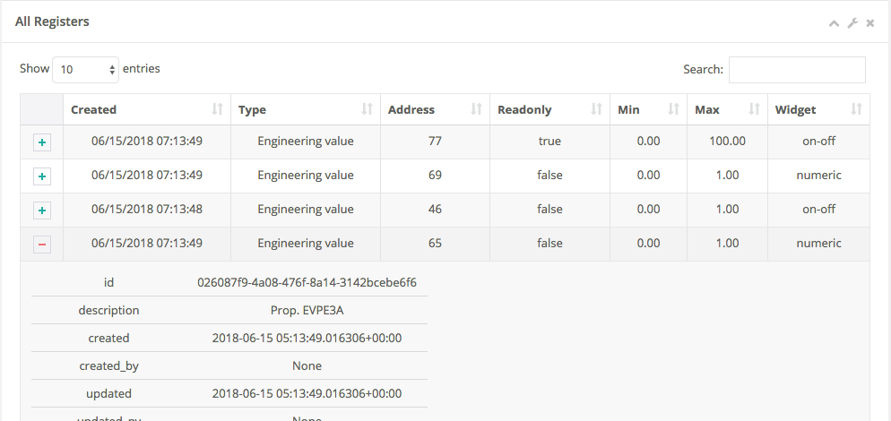

row details customization
-------------------------

The default implementation of render_row_details() tries to load a template
in the following order:

- ajax_datatable/<app_label>/<model_name>/<render_row_details_template_name>
- ajax_datatable/<app_label>/<render_row_details_template_name>
- ajax_datatable/<render_row_details_template_name>

(where the default value for <render_row_details_template_name> is "render_row_details.html")

and, when found, uses it for rendering.

The template receives the following context::

    html = template.render({
        'model': self.model,
        'model_admin': self.get_model_admin(),
        'object': obj,
    }, request)

`model_admin`, when available, can be used to navigate fieldsets (if defined)
in the template, much like django's `admin/change_form.html` does.

If no template is available, a simple HTML table with all field values
is built instead.

In all cases, the resulting HTML will be wrapped in the following structure:

.. code :: html

    <tr class="details">
        <td class="details">
            

                ...

Filter by global date range
---------------------------

When a `latest_by` column has been specified and `show_date_filter` is active,
a global date range filtering widget is provided, based on `jquery-ui.datepicker`:

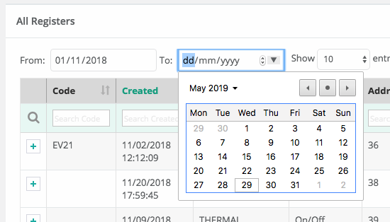

The header of the column used for date filtering is decorated with the class
"latest_by"; you can use it to customize it's rendering.

You can fully replace the widget with your own by providing a custom **fn_daterange_widget_initialize()**
callback at Module's initialization, as in the following example, where we
use `bootstrap.datepicker`:

.. code:: html

    AjaxDatatableViewUtils.init({
        search_icon_html: '<i class="fa fa-search"></i>',
        language: {
        },
        fn_daterange_widget_initialize: function(table, data) {
            var wrapper = table.closest('.dataTables_wrapper');
            var toolbar = wrapper.find(".toolbar");
            toolbar.html(
                '
' +
                ': <input type="text" class="date_from" autocomplete="off">' +
                '&nbsp;&nbsp;' +
                ': <input type="text" class="date_to" autocomplete="off">' +
                '
'
            );
            var date_pickers = toolbar.find('.date_from, .date_to');
            date_pickers.datepicker();
            date_pickers.on('change', function(event) {
                // Annotate table with values retrieved from date widgets
                var dt_from = toolbar.find('.date_from').data("datepicker");
                var dt_to = toolbar.find('.date_to').data("datepicker");
                table.data('date_from', dt_from ? dt_from.getFormattedDate("yyyy-mm-dd") : '');
                table.data('date_to', dt_to ? dt_to.getFormattedDate("yyyy-mm-dd") : '');
                // Redraw table
                table.api().draw();
            });
        }
    });

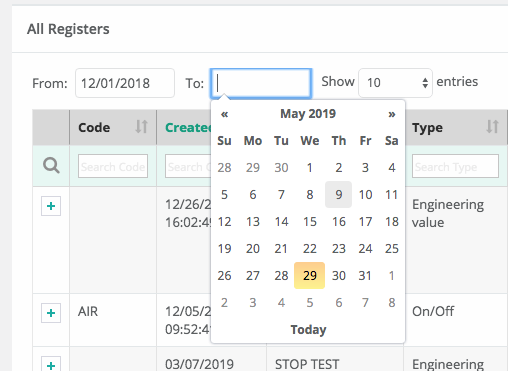

Debugging
---------

In case of errors, Datatables.net shows an alert popup:

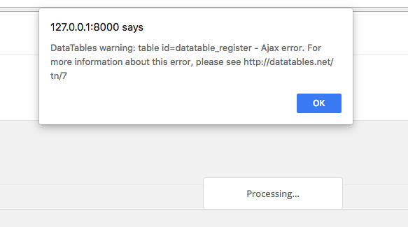

You can change it to trace the error in the browser console, insted:

.. code:: javascript

    // change DataTables' error reporting mechanism to throw a Javascript
    // error to the browser's console, rather than alerting it.
    $.fn.dataTable.ext.errMode = 'throw';

All details of Datatables.net requests can be logged to the console by activating
this setting::

    AJAX_DATATABLE_ENABLE_QUERYDICT_TRACING = True

The resulting query (before pagination) can be traced as well with::

    AJAX_DATATABLE_ENABLE_QUERYSET_TRACING = True

Debugging traces for date range filtering, column filtering or global filtering can be displayed
by activating this setting::

    AJAX_DATATABLE_TEST_FILTERS

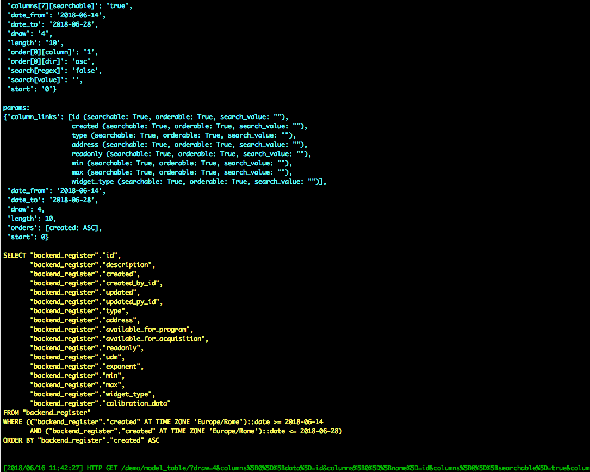

Generic tables (advanced topic)
===============================

Chances are you might want to supply a standard user interface for listing
several models.

In this case, it is possible to use a generic approach and avoid code duplications,
as detailed below.

First, we supply a generic view which receives a model as parameter,
and passes it to the template used for rendering the page:

file `frontend/datatables_views.py`:

.. code:: python

    @login_required
    def object_list_view(request, model, template_name="frontend/pages/object_list.html"):
        """
        Render the page which contains the table.
        That will in turn invoke (via Ajax) object_datatable_view(), to fill the table content
        """
        return render(request, template_name, {
            'model': model,
        })

In the urlconf, link to specific models as in the example below:

file `frontend/urls.py`:

.. code:: python

    path('channel/', datatables_views.object_list_view, {'model': backend.models.Channel, }, name="channel-list"),

The template uses the `model` received in the context to display appropriate `verbose_name`
and `verbose_name_plural` attributes, and to extract `app_label` and `model_name`
as needed; unfortunately, we also had to supply some very basic helper templatetags,
as the `_meta` attribute of the model is not directly visible in this context.

.. code:: html

    
    

    
        <li>
            <a href=""></a>
        </li>
        <li class="active">
            <strong>{{model|model_verbose_name_plural}}</strong>
        </li>
    

    

        
        
            <h2></h2>
        

            

                <h5> {{ model|model_verbose_name_plural }}</h5>
                
                    <a href="#"></a>
                
            

            

                <table id="datatable" width="100%" class="table table-striped table-bordered table-hover dataTables-example">
                </table>
            

            
                <a href="#"></a>
            

        

    

    
        
    

app_label and model_name are just strings, and as such can be specified in an url.

The connection with the Django backend uses the following generic url::

    

from `urls.py`::

    # List any Model
    path('datatable/<str:app_label>/<str:model_name>/', datatables_views.object_datatable_view, name="object-datatable"),

object_datatable_view() is a lookup helper which navigates all AjaxDatatableView-derived
classes in the module and selects the view appropriate for the specific model
in use:

file `frontend/datatables_views.py`:

.. code:: python

    import inspect

    def object_datatable_view(request, app_label, model_name):

        # List all AjaxDatatableView in this module
        datatable_views = [
            klass
            for name, klass in inspect.getmembers(sys.modules[__name__])
            if inspect.isclass(klass) and issubclass(klass, AjaxDatatableView)
        ]

        # Scan AjaxDatatableView until we find the right one
        for datatable_view in datatable_views:
            model = datatable_view.model
            if (model is not None and (model._meta.app_label, model._meta.model_name) == (app_label, model_name)):
                view = datatable_view
                break

        return view.as_view()(request)

which for this example happens to be:

.. code:: python

    @method_decorator(login_required, name='dispatch')
    class ChannelAjaxDatatableView(BaseAjaxDatatableView):

        model = Channel
        title = 'Channels'

        column_defs = [
            AjaxDatatableView.render_row_tools_column_def(),
            {
                'name': 'id',
                'visible': False,
            }, {
                'name': 'description',
            }, {
                'name': 'code',
            }
        ]

Javascript Code Snippets
========================

Workaround: Adjust the column widths of all visible tables
----------------------------------------------------------

.. code:: javascript

    setTimeout(function () {
        AjaxDatatableViewUtils.adjust_table_columns();
    }, 200);

or maybe better:

.. code:: javascript

    var table = element.DataTable({
        ...
        "initComplete": function(settings) {
            setTimeout(function () {
                AjaxDatatableViewUtils.adjust_table_columns();
            }, 200);
        }

where:

.. code:: javascript

    function adjust_table_columns() {
        // Adjust the column widths of all visible tables
        // https://datatables.net/reference/api/%24.fn.dataTable.tables()
        $.fn.dataTable
            .tables({
                visible: true,
                api: true
            })
            .columns.adjust();
    }

Redraw all tables
-----------------

.. code:: javascript

    $.fn.dataTable.tables({
        api: true
    }).draw();

Redraw table holding the current paging position
------------------------------------------------

.. code:: javascript

    table = $(element).closest('table.dataTable');
    $.ajax({
        type: 'GET',
        url: ...
    }).done(function(data, textStatus, jqXHR) {
        table.DataTable().ajax.reload(null, false);
    });

Redraw a single table row
-------------------------

TODO: THIS DOESN'T SEEM TO WORK PROPERLY 😭

.. code:: javascript

    table.DataTable().row(tr).invalidate().draw();

Example:

.. code:: javascript

    var table = $(element).closest('table.dataTable');
    var table_row_id = table.find('tr.shown').attr('id');
    $.ajax({
        type: 'POST',
        url: ...
    }).done(function(data, textStatus, jqXHR) {
        table.DataTable().ajax.reload(null, false);

        // Since we've update the record via Ajax, we need to redraw this table row
        var tr = table.find('#' + table_row_id);
        var row = table.DataTable().row(tr)
        row.invalidate().draw();

        // Hack: here we would like to enhance the updated row, by adding the 'updated' class;
        // Since a callback is not available upon draw completion,
        // let's use a timer to try later, and cross fingers
        setTimeout(function() {
            table.find('#' + table_row_id).addClass('updated');
        }, 200);
        setTimeout(function() {
            table.find('#' + table_row_id).addClass('updated');
        }, 1000);

    });

change DataTables' error reporting mechanism
--------------------------------------------

.. code:: javascript

    // change DataTables' error reporting mechanism to throw a Javascript
    // error to the browser's console, rather than alerting it.
    $.fn.dataTable.ext.errMode = 'throw';

JS Utilities
============

- AjaxDatatableViewUtils.init(options)
- AjaxDatatableViewUtils.initialize_table(element, url, extra_options={}, extra_data={})
- AjaxDatatableViewUtils.after_table_initialization(table, data, url)
- AjaxDatatableViewUtils.adjust_table_columns()
- AjaxDatatableViewUtils.redraw_all_tables()
- AjaxDatatableViewUtils.redraw_table(element)

Internationalization
--------------------

You can provide localized messages by initializing the AjaxDatatableViewUtils JS module
as follow (example in italian):

.. code:: javascript

    AjaxDatatableViewUtils.init({
        search_icon_html: '<i class="fa fa-search" style="font-size: 16px"></i>',
        language: {
            "decimal":        "",
            "emptyTable":     "Nessun dato disponibile",
            "info":           "Visualizzate da _START_ a _END_ di _TOTAL_ righe",
            "infoEmpty":      "",
            "infoFiltered":   "(filtered from _MAX_ total entries)",
            "infoPostFix":    "",
            "thousands":      ",",
            "lengthMenu":     "Visualizza _MENU_ righe per pagina",
            "loadingRecords": "Caricamento in corso ...",
            "processing":     "Elaborazione in corso ...",
            "search":         "Cerca:",
            "zeroRecords":    "Nessun record trovato",
            "paginate": {
                "first":      "Prima",
                "last":       "Ultima",
                "next":       ">>",
                "previous":   "<<"
            },
            "aria": {
                "sortAscending":  ": activate to sort column ascending",
                "sortDescending": ": activate to sort column descending"
            }
        }
    });

You can do this, for example, in your "base.html" template, and it will be in effect
for all subsequent instantiations:

.. code:: html

    

Application examples
====================

Customize row details by rendering prettified json fields
---------------------------------------------------------

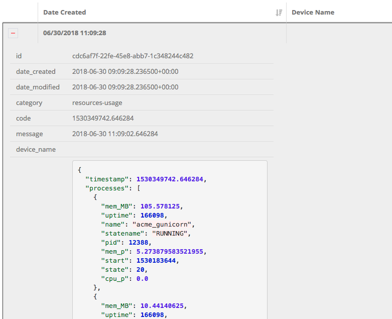

.. code:: python

    import jsonfield
    from ajax_datatable.views import AjaxDatatableView
    from .utils import json_prettify

    class MyAjaxDatatableView(AjaxDatatableView):

        ...

        def render_row_details(self, id, request=None):

            obj = self.model.objects.get(id=id)
            fields = [f for f in self.model._meta.get_fields() if f.concrete]
            html = '<table class="row-details">'
            for field in fields:
                value = getattr(obj, field.name)
                if isinstance(field, jsonfield.JSONField):
                    value = json_prettify(value)
                html += '<tr><td>%s</td><td>%s</td></tr>' % (field.name, value)
            html += '</table>'
            return html

where:

.. code:: python

    import json
    from pygments import highlight
    from pygments.lexers import JsonLexer
    from pygments.formatters import HtmlFormatter
    from django.utils.safestring import mark_safe

    def json_prettify_styles():
        """
        Used to generate Pygment styles (to be included in a .CSS file) as follows:
            print(json_prettify_styles())
        """
        formatter = HtmlFormatter(style='colorful')
        return formatter.get_style_defs()

    def json_prettify(json_data):
        """
        Adapted from:
        https://www.pydanny.com/pretty-formatting-json-django-admin.html
        """

        # Get the Pygments formatter
        formatter = HtmlFormatter(style='colorful')

        # Highlight the data
        json_text = highlight(
            json.dumps(json_data, indent=2),
            JsonLexer(),
            formatter
        )

        # # remove leading and trailing brances
        # json_text = json_text \
        #     .replace('{\n', '') \
        #     .replace('}\n', '')

        # Get the stylesheet
        #style = ""
        style = ''

        # Safe the output
        return mark_safe(style + json_text)

Change row color based on row content
-------------------------------------

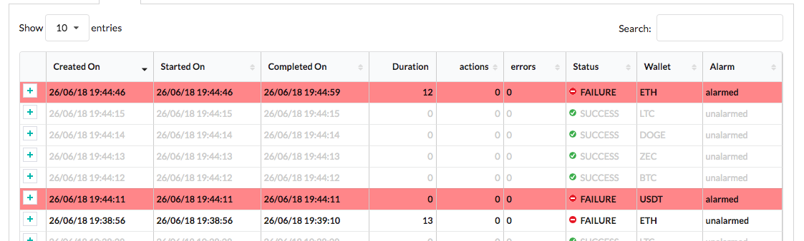

First, we mark the relevant info with a specific CSS class, so we can search
for it later

.. code:: html

    column_defs = [
        ...
        }, {
            'name': 'error_counter',
            'title': 'errors',
            'className': 'error_counter',
        }, {
        ...
    ]

Have a callback called after each table redraw

.. code:: javascript

    var table = element.DataTable({
        ...
    });

    table.on('draw.dt', function(event) {
        onTableDraw(event);
    });

then change the rendered table as needed

.. code:: javascript

    var onTableDraw = function (event) {

        var html_table = $(event.target);
        html_table.find('tr').each(function(index, item) {

            try {
                var row = $(item);
                text = row.children('td.error_counter').first().text();
                var error_counter = isNaN(text) ? 0 : parseInt(text);

                if (error_counter > 0) {
                    row.addClass('bold');
                }
                else {
                    row.addClass('grayed');
                }
            }
                catch(err) {
            }

        });
    }

**or use a rowCallback as follows:**

.. code:: html

    // Subscribe "rowCallback" event
    $('#datatable').on('rowCallback', function(event, table, row, data ) {
        $(row).addClass(data.read ? 'read' : 'unread');
    }

This works even if the 'read' column we're interested in is actually not visible.

Modify table content on the fly (via ajax)
------------------------------------------

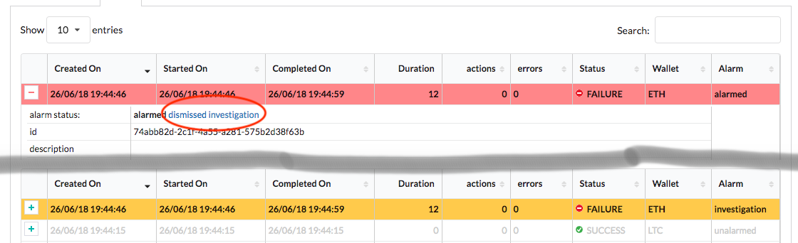

Row details customization:

.. code:: javascript

    def render_row_details(self, id, request=None):

        obj = self.model.objects.get(id=id)
        html = '<table class="row-details">'
        html += "<tr><td>alarm status:</td><td>"
        for choice in BaseTask.ALARM_STATUS_CHOICES:
            # Lo stato corrente lo visualizziamo in grassetto
            if choice[0] == obj.alarm:
                html += '<b>%s</b>&nbsp;' % (choice[1])
            else:
                # Se non "unalarmed", mostriamo i link per cambiare lo stato
                # (tutti tranne "unalarmed")
                if obj.alarm != BaseTask.ALARM_STATUS_UNALARMED and choice[0] != BaseTask.ALARM_STATUS_UNALARMED:
                    html += '<a class="set-alarm" href="#" onclick="set_row_alarm(this, \'%s\', %d); return false">%s</a>&nbsp;' % (
                        str(obj.id),
                        choice[0],
                        choice[1]
                    )
        html += '</td></tr>'

Client-side code:

.. code:: javascript

    <script language="javascript">

        function set_row_alarm(element, task_id, value) {
            $("body").css("cursor", "wait");
            //console.log('set_row_alarm: %o %o %o', element, task_id, value);
            table = $(element).closest('table.dataTable');
            //console.log('table id: %o', table.attr('id'));

            $.ajax({
                type: 'GET',
                url: sprintf('/set_alarm/%s/%s/%d/', table.attr('id'), task_id, value),
                dataType: 'html'
            }).done(function(data, textStatus, jqXHR) {
                table.DataTable().ajax.reload(null, false);
            }).always(function( data, textStatus, jqXHR) {
                $("body").css("cursor", "default");
            });
        }

Server-side code:

.. code:: javascript

    urlpatterns = [
        ...
        path('set_alarm/<str:table_id>/<uuid:task_id>/<int:new_status>/',
            views.set_alarm,
            name="set_alarm"),
    ]

    @login_required
    def set_alarm(request, table_id, task_id, new_status):

        # Retrieve model from table id
        # Example table_id:
        #   'datatable_walletreceivetransactionstask'
        #   'datatable_walletcheckstatustask_summary'
        model_name = table_id.split('_')[1]
        model = apps.get_model('tasks', model_name)

        # Retrieve task
        task = get_object_by_uuid_or_404(model, task_id)

        # Set alarm value
        task.set_alarm(request, new_status)

        return HttpResponse('ok')

Possible future improvements
============================

Check these extensions:
-----------------------

- `Table row selection <https://datatables.net/extensions/select/>`_
- `Export table data to excel of pdf <https://datatables.net/extensions/buttons/>`_
- `Responsive table <https://datatables.net/extensions/responsive/>`_

Column rendering
----------------

- specific rendering for boolean columns

Column filtering
----------------

add a specific widget for dates
...............................

Currently, an exact match is applied; a date-range selection would be better;
references:

- https://datatables.net/plug-ins/filtering/row-based/range_dates
- https://datatables.net/extensions/select/
- https://github.com/RobinDev/jquery.dataTables.columnFilter.js?files=1

support for optional autocompletion widget
..........................................

- https://github.com/yourlabs/django-autocomplete-light
- https://github.com/crucialfelix/django-ajax-selects

add a specific widget for boolean fields
........................................

A checkbox or a select

